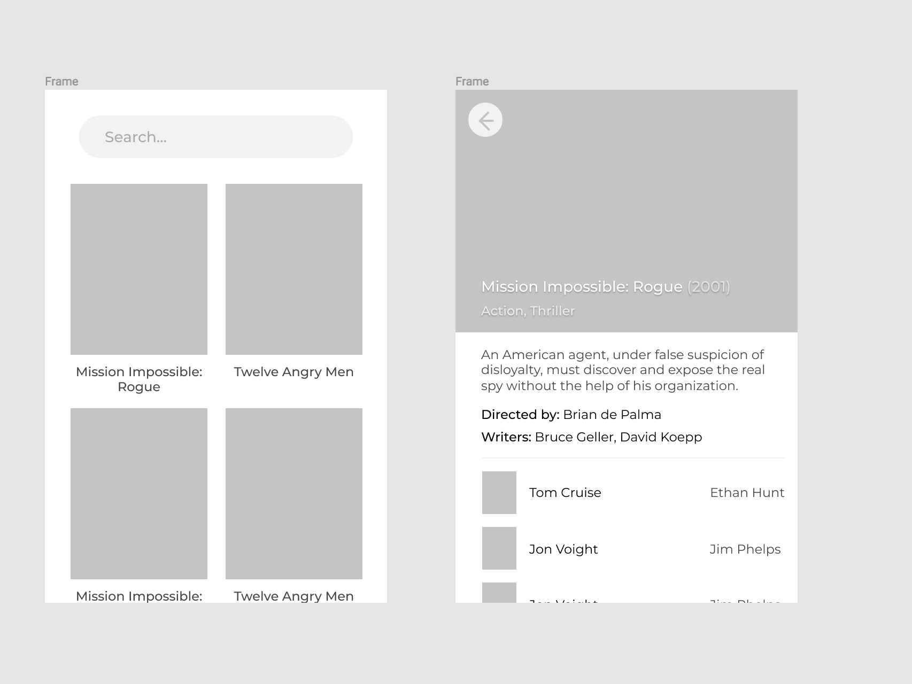
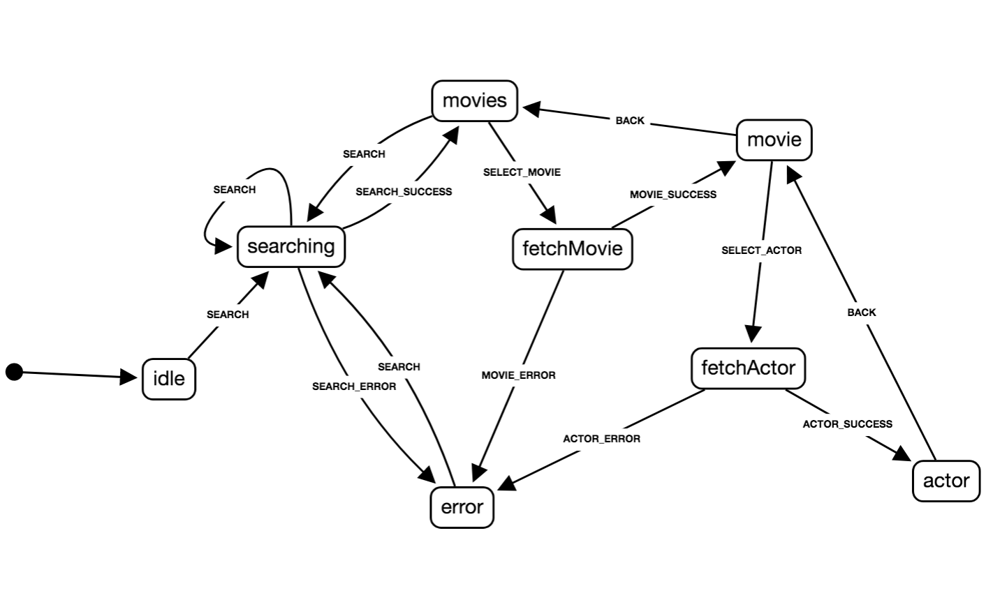

# Iteam - Skills assessment
Live version at: http://tomekander.chas.academy/stuff/iteam/
## How-To
Create an `.env`-file in the project-root.

Add the API-key for TMDB (see .env.dist for a specifcation).

### Usage
```
npm run start
```

#### Build-version
```
npm run build
```
### Tests

```
npm run test
```

## Basic Wireframe



## State Chart



